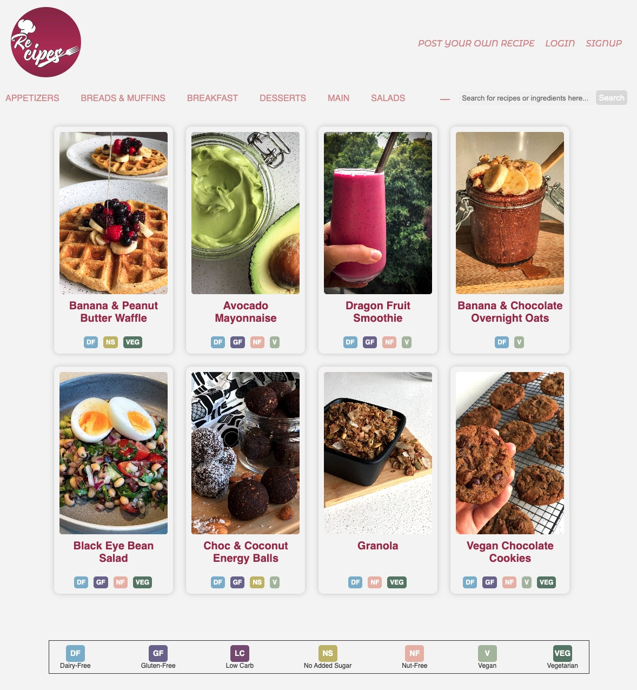

#**CRUD FLASK APP - Project 2 - Re-cipes**
Project submission for [General Assembly](https://generalassemb.ly) Software Engineering Course flex mode (end of Unit 2). 

To check my project go to this [link]().

 

---
#### **The technical requirements for this project were:**
- Have at least 2 tables – one of them should represent the people using your application (users).
- Include sign up/log in functionality, with encrypted passwords & an authorization flow.
- Modify data in the database. There should be ways for users to add/change some data in the database.
- Have semantically clean HTML and CSS.
- Be deployed online and accessible to the public (still not deployed)

---
Plan

Step 1
1. Choose an idea to work on.
A Recipe Book application to be able to share/save your favorite recipes.
2. Define the requirements and plan app functionalities.
User authentication, recipe creation, search by ingredient/category, dietary categories, filters, favorites, ratings, comments and sharing.
3. Plan data model.
Users: This table will store information about the users of the app, such as their name, email address, and password
Recipes: This table will store information about the recipes that users create and share.
Favorites: This table will store information about the recipes that users have marked as favorites
4. Deploy online.

Step 2
1. Set up development environment - flask, PostgreSQL, virtual environment
2. Make the app work - Homepage, login, signup, etc
3. Build the additional pages and functionalities.

Set 3 
1. Add styling
2. Add APIs

Set 4
1. Deploy and present

Technologies used
* Webframework: Flask
* Back End: Phyton and PostgreSQL
* Front End: HTML, CSS and Javascript
* Cloudinary

#### **Future Implementations**
- Implement reCaptcha
- Include Favorites, ratings, comments and sharing.
